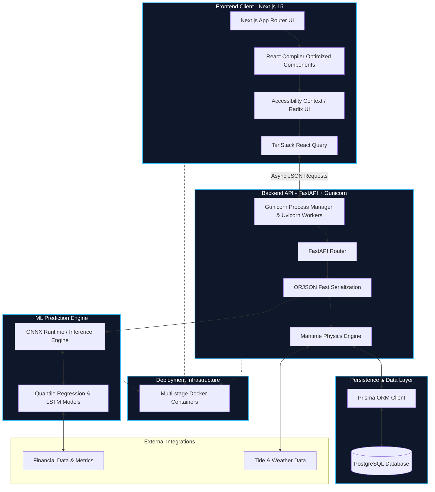

# KargoSetu System Architecture

This document provides a comprehensive overview of the KargoSetu system architecture, highlighting our hyper-optimized data flow, rendering strategies, and machine learning pipelines.

## High-Level Architecture Diagram

The following Mermaid flowchart illustrates the precise interaction between the frontend client, the backend API, the database, and the ML prediction engine. We have integrated industry-leading optimizations including Next.js React Compiler, Gunicorn ASGI deployment, and ONNX Runtime for blistering fast inference.

## Architectural Hyper-Optimizations

Our system is engineered to handle massive logistics data with zero-latency predictions. Key optimizations include:

1. **Frontend**:
    - **React Compiler**: Next.js 15 uses the React Compiler to auto-memoize components, completely eliminating unnecessary re-renders.
    - **Strict ESLint & Accessibility**: Enforced strict linting and WCAG accessibility standards ensure a robust, inclusive, and bug-free user interface.
2. **Backend Engine**:
    - **FastAPI with Gunicorn**: We leverage Gunicorn with Uvicorn worker classes to handle concurrent incoming requests robustly.
    - **ORJSON**: Replaced standard JSON parsing with `orjson` for the fastest possible API response serialization.
3. **Machine Learning Engine**:
    - **ONNX Runtime**: Transitioned our deep learning models (LSTM/Quantile regression) into ONNX format, executed via the highly optimized ONNX Runtime for bare-metal inference speeds.
4. **DevOps & Infrastructure**:
    - **Multi-stage Docker**: Containerized the entire stack using multi-stage builds to drastically reduce image sizes and minimize the deployment attack surface.

---

### Potential Judge Questions

Based on the provided architecture document for KargoSetu, here are 10 probing technical questions I would ask the team during their presentation:

1. **On the WSGI vs. ASGI Discrepancy:** Your documentation text explicitly mentions "Gunicorn ASGI deployment" with Uvicorn workers, but your Mermaid diagram labels the backend node as `WSGI[Gunicorn Process Manager...]`. Can you clarify whether you are using a WSGI or ASGI setup, and how you have tuned your worker processes to handle the high concurrency required by this system?
2. **On the "Zero-Latency" Claim:** You claim the system handles "massive logistics data with zero-latency predictions." However, the architecture relies on live external data from Yahoo Finance (YF) and Tide/Weather APIs (Meteo). How are you realistically handling network I/O latency, rate-limiting, and data synchronization from these external sources to achieve near-zero latency?
3. **On React Compiler Capabilities:** You state that the Next.js 15 React Compiler "completely eliminates unnecessary re-renders." Since auto-memoization relies on specific heuristics and cannot always perfectly predict complex state dependencies, did you profile the frontend to verify this, and did you encounter any edge cases where manual optimization was still necessary?
4. **On ML Data Ingestion:** The architecture diagram shows your ML Models (Quantile Regression & LSTM) communicating directly with the external financial data source (YF). Typically, data fetching and preprocessing are decoupled from the ONNX inference engine. How are you handling the data pipeline and feature engineering before the data reaches the ONNX runtime?
5. **On Backend Thread Blocking:** The "Maritime Physics Engine" sits within your FastAPI backend. Physics calculations are typically CPU-bound. How are you ensuring that these heavy mathematical computations don't block the Python asyncio event loop and degrade the performance of your FastAPI endpoints?
6. **On Database Performance:** You are using Prisma ORM with PostgreSQL to handle "massive logistics data." While Prisma offers great developer experience, it can sometimes generate inefficient SQL for heavy analytical queries or large joins. Have you implemented connection pooling (e.g., PgBouncer), or did you have to write raw SQL for the more complex maritime data queries?
7. **On ORJSON Serialization Limitations:** You are using ORJSON for fast serialization of data coming from the ML models and physics engine. Did you encounter any issues serializing complex data types like NumPy arrays, tensors, or custom physics objects, which ORJSON does not natively support without custom default hooks?
8. **On State Synchronization:** Your frontend utilizes TanStack React Query for async communication. Given the dynamic nature of maritime logistics (weather, tides, and financial metrics), what is your caching, polling, and cache-invalidation strategy to ensure the Next.js UI reflects real-time changes without overwhelming the backend? 
9. **On Container Strategy:** You mention using "Multi-stage Docker Containers" for deployment, and your diagram shows the Infra wrapper enveloping Frontend, Backend, and ML. Are the FastAPI backend, the Physics Engine, and the ONNX Runtime deployed within a single monolithic container, or have you decoupled them into independent microservices to scale CPU (for physics) and potentially GPU (for ML) resources independently?
10. **On Fault Tolerance:** Your critical internal systems (the Maritime Physics Engine and the ML Models) have hard dependencies on external APIs (Meteo and YF). What architectural fallbacks, circuit breakers, or caching mechanisms have you designed in the event that these third-party integrations experience downtime or severe latency?
