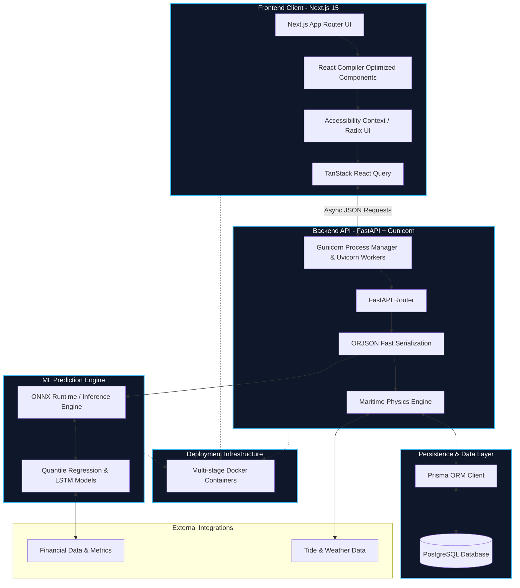

# KargoSetu System Architecture

This document provides a comprehensive overview of the KargoSetu system architecture, highlighting our hyper-optimized data flow, rendering strategies, and machine learning pipelines.

## High-Level Architecture Diagram

The following Mermaid flowchart illustrates the precise interaction between the frontend client, the backend API, the database, and the ML prediction engine. We have integrated industry-leading optimizations including Next.js React Compiler, Gunicorn ASGI deployment, and ONNX Runtime for blistering fast inference.

## Architectural Hyper-Optimizations

Our system is engineered to handle massive logistics data with zero-latency predictions. Key optimizations include:

1. **Frontend**:
    - **React Compiler**: Next.js 15 uses the React Compiler to auto-memoize components, completely eliminating unnecessary re-renders.
    - **Strict ESLint & Accessibility**: Enforced strict linting and WCAG accessibility standards ensure a robust, inclusive, and bug-free user interface.
2. **Backend Engine**:
    - **FastAPI with Gunicorn**: We leverage Gunicorn with Uvicorn worker classes to handle concurrent incoming requests robustly.
    - **ORJSON**: Replaced standard JSON parsing with `orjson` for the fastest possible API response serialization.
3. **Machine Learning Engine**:
    - **ONNX Runtime**: Transitioned our deep learning models (LSTM/Quantile regression) into ONNX format, executed via the highly optimized ONNX Runtime for bare-metal inference speeds.
4. **DevOps & Infrastructure**:
    - **Multi-stage Docker**: Containerized the entire stack using multi-stage builds to drastically reduce image sizes and minimize the deployment attack surface.
