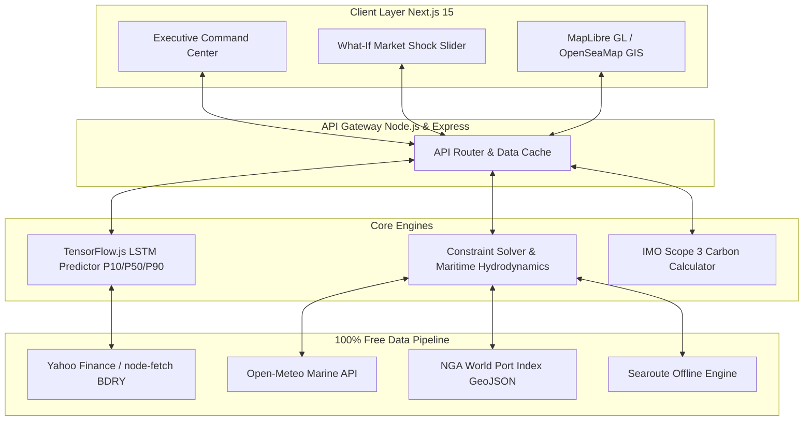
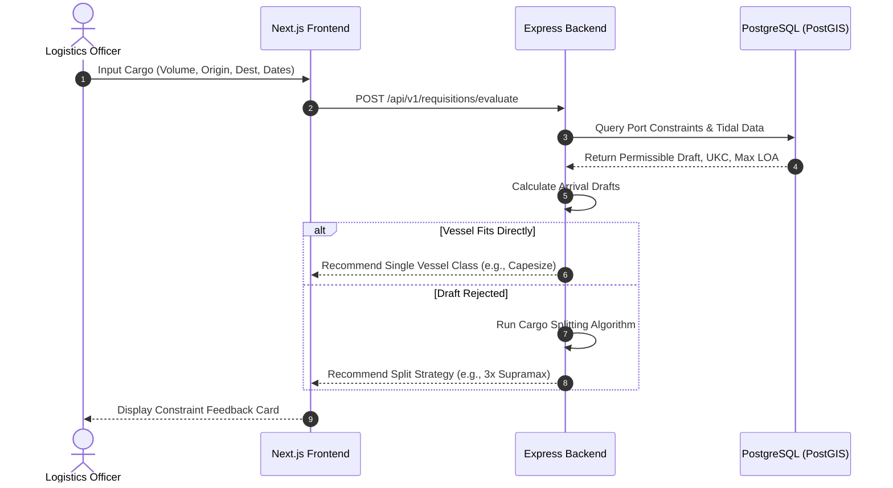
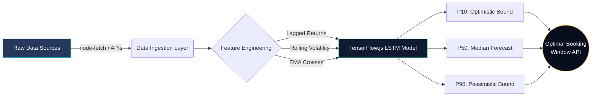
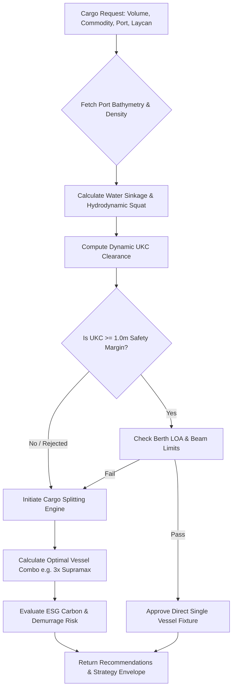

# MODULE 8: SYSTEM ARCHITECTURE & FLOWCHARTS

This document contains Mermaid diagrams visualizing the end-to-end architecture, user workflows, and data pipelines for KargoSetu. 

## 8.1 High-Level System Architecture

## 8.2 Sequence Diagram: Charter Requisition Workflow

## 8.3 Flowchart: Machine Learning Predictive Pipeline

## 8.4 Constraint Solver Algorithm Flowchart

