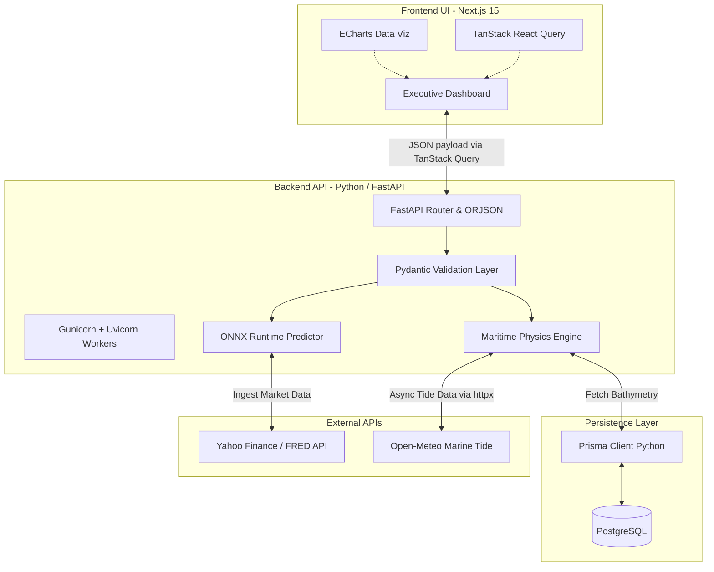

<!-- PROJECT SHIELDS -->
<div align="center">
  <a href="#"></a>
  <a href="#"></a>
  <a href="#"></a>
  <a href="#"></a>
  <a href="#"></a>
</div>

<!-- PROJECT LOGO & HEADER -->
<br />
<div align="center">
  

  <h2 align="center">Intelligent Freight Forecasting & Bulk Cargo Procurement</h2>

  <p align="center">
    <strong>Official Submission for Smart India Hackathon (SIH) 2026</strong>
    <br />
    <br />
    <a href="MIGRATION_PLAN.md"><strong>Explore the Backend Migration Plan »</strong></a>
    <br />
    <br />
    <a href="#">View Live Demo</a>
    ·
    <a href="#">Watch Pitch Video</a>
    ·
    <a href="DEVELOPER_GUIDE.md">Read Developer Guide</a>
  </p>
</div>

<hr />

## SYSTEM OVERVIEW: SIH 26006

<details>
  <summary><strong>Click to expand Problem Statement Details</strong></summary>

| Category | Details |
| :--- | :--- |
| **Problem Statement ID** | `SIH26006` |
| **Problem Title** | Intelligent Freight Forecasting & Bulk Cargo Procurement Platform for East Coast of India |
| **Target Organization** | Ministry of Steel (SAIL) |
| **Hackathon Theme** | Smart Automation & Logistics |

> **Core Objective:** Eradicate the financial inefficiency of single spot contract dependency. KargoSetu enables highly predictive Short/Medium-Term Contracts of Affreightment (CoA) paired with dual-ended port constraint optimization, maximizing fleet ROI and minimizing idle losses for the Ministry of Steel.
</details>

<hr />

## SYSTEM ARCHITECTURE & DATA FLOW

The KargoSetu platform is powered by a hyper-optimized architecture. We utilize **Next.js 15 with the React Compiler** for zero-overhead frontend rendering, and a **FastAPI backend managed by Gunicorn** leveraging **ORJSON** for lightning-fast serialization. Machine learning inference is accelerated via **ONNX Runtime**, and the entire stack is securely containerized using **multi-stage Docker builds**.

For a comprehensive structural breakdown, please see our [Architecture Documentation](ARCHITECTURE.md).



<hr />

## CORE CAPABILITIES & BUSINESS IMPACT

### 1. Optimal Market Entry Timing & Quantile Forecasting (ONNX Runtime)
*   **Mechanism:** Multi-horizon Quantile Regression models trained in TensorFlow/Keras and exported to ONNX. Inference is executed in C++ on the backend via ONNX Runtime for ultra-low latency predictions of 30, 60, and 90-day freight rate curves.
*   **Impact:** Automatically detects 12.5% rate dip windows, alerting executives to trigger optimal CoA contract bookings.

### 2. Dual-Ended Port Infrastructure & Vessel Type Optimization
*   **Mechanism:** Analyzes Draft, LOA, Beam, and Daily Handling Rates at both origin (e.g., Newcastle) and destination (e.g., Haldia). Handled via asynchronous DB transactions.
*   **Impact:** Auto-recommends Capesize, Panamax, Supramax, or calculates optimal offshore lighterage and cargo splitting thresholds.

<hr />

## TECHNOLOGY STACK

**Frontend Environment**<br/>


**Backend & Physics Engine**<br/>


**Machine Learning & Intelligence**<br/>


<hr />

## LOCAL DEMO SETUP (2 terminals, ~5 minutes)

Run the full SIH demo locally: FastAPI backend on `:8000` + Next.js frontend on `:3000`, then open the live globe.

Prerequisites: Node.js 24.x, Python 3.11.9 (see `.python-version`), and a reachable Postgres `DATABASE_URL`. If the database is unreachable the API still boots in degraded mode (vessel/hazard/corridor feeds keep working; DB-backed endpoints fail per-request).

<details open>
  <summary><strong>Terminal 1 - Backend (FastAPI, port 8000)</strong></summary>
  <br/>

  ```bash
  # From the repo root
  cd backend

  # Install Python dependencies (first time only)
  pip install -r requirements.txt

  # Configure environment (first time only)
  copy .env.example .env
  # Edit .env: set DATABASE_URL, DIRECT_URL, JWT_SECRET_KEY.
  # Leave AISSTREAM_API_KEY / FIRMS_MAP_KEY empty for demo traffic,
  # or paste free keys (see FREE LIVE-DATA KEYS below) for live feeds.

  # Boot the API with auto-reload
  uvicorn app.main:app --reload --host 127.0.0.1 --port 8000
  ```
  *Health check: `http://127.0.0.1:8000/api/health` — expect `"status": "ok"` (or `"degraded"` without a database). Vessel feed: `http://127.0.0.1:8000/api/v1/vessels/live` — expect `"mode": "demo"` (or `"live"` with a key).*
</details>

<details open>
  <summary><strong>Terminal 2 - Frontend (Next.js, port 3000)</strong></summary>
  <br/>

  ```bash
  # From the repo root, in a second terminal
  cd frontend

  # Install Node dependencies (first time only)
  npm install

  # Point the UI at the local API, then boot
  # Ensure frontend/.env.local contains: NEXT_PUBLIC_API_URL="http://localhost:8000"
  npm run dev
  ```
  *Open `http://localhost:3000/dashboard/globe` for the Gods Eye View (Connecting badge, then Demo traffic with 28 vessels), or `http://localhost:3000` for the landing page.*
</details>

<details>
  <summary><strong>Shortcut - both servers at once</strong></summary>
  <br/>

  ```bash
  # From the repo root (needs install done once: make install)
  make up
  ```
</details>

### FREE LIVE-DATA KEYS (optional, demo works without them)

Without keys the globe shows badged **Demo traffic** (28 realistic Bay of Bengal vessels) and real USGS/Open-Meteo hazards. Paste these free keys into `backend/.env` and restart the backend for the green **Live** badge.

- **AISStream.io (live vessels)** — free signup, no card:
  1. Go to `https://aisstream.io` and create an account.
  2. Open the dashboard and generate an API key.
  3. Set `AISSTREAM_API_KEY=your_key_here` in `backend/.env` and restart uvicorn.
  4. Docs: `https://aisstream.io/documentation`. The backend opens a bounded 5-second collect window per request (30s cache), so normal demo use stays far inside free limits.
- **NASA FIRMS (active fires)** — free MAP_KEY, no card:
  1. Go to `https://firms.modaps.eosdis.nasa.gov/api/map_key` and request a MAP_KEY with your email.
  2. Set `FIRMS_MAP_KEY=your_key_here` in `backend/.env` and restart uvicorn.
  3. Without it the fires layer reports `disabled` and the globe simply hides it — never an error.
- Keys stay server-side in `.env` (gitignored) and HF Spaces secrets in production. Never commit them.

<hr />

## ENTERPRISE SECURITY & OPTIMIZATIONS
This system is engineered to enterprise logistics standards:
* **Multi-stage Docker Builds:** Ensures minimal image sizes and a hardened attack surface for production deployments.
* **High-Performance Serialization:** Uses `orjson` in FastAPI for the fastest JSON serialization available in Python.
* **Payload Validation:** Strict `Pydantic` schemas enforced on all Server parameters.
* **ML Sandboxing & ONNX:** Dedicated asynchronous `asyncio.to_thread()` implementations run highly optimized ONNX inference, preventing I/O blocking during high-load LSTM prediction sequences.
* **Database Pooling:** `prisma.connect()` and `disconnect()` managed via FastAPI Lifespan Hooks to prevent zombie connections.

<hr />

## PROJECT CONTRIBUTORS
* **Nishant** - Full Stack Architect & ML Lead
* *(Additional team members to be added)*

<br/>
<div align="center">
  <p>Engineered for the Smart India Hackathon 2026</p>
</div>

