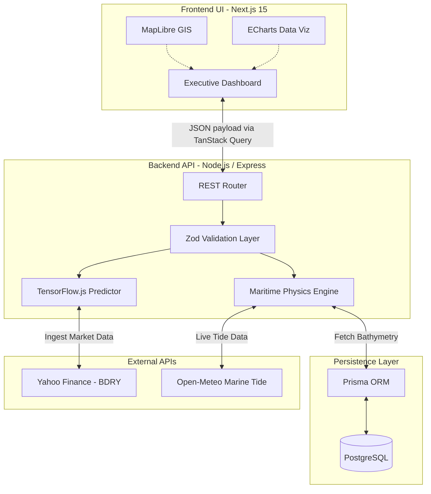

<!-- PROJECT SHIELDS -->
<div align="center">
  <a href="#"></a>
  <a href="#"></a>
  <a href="#"></a>
  <a href="#"></a>
  <a href="#"></a>
</div>

<!-- PROJECT LOGO & HEADER -->
<br />
<div align="center">
  

  <h2 align="center">Intelligent Freight Forecasting & Bulk Cargo Procurement</h2>

  <p align="center">
    <strong>Official Submission for Smart India Hackathon (SIH) 2026</strong>
    <br />
    <br />
    <a href="Docs/10_Comprehensive_Architecture_And_Security_Plan.md"><strong>Explore the Technical Architecture »</strong></a>
    <br />
    <br />
    <a href="#">View Live Demo</a>
    ·
    <a href="#">Watch Pitch Video</a>
    ·
    <a href="#">Read Developer Guide</a>
  </p>
</div>

<hr />

## SYSTEM OVERVIEW: SIH 26006

| Category | Details |
| :--- | :--- |
| **Problem Statement ID** | `SIH26006` |
| **Problem Title** | Intelligent Freight Forecasting & Bulk Cargo Procurement Platform for East Coast of India |
| **Target Organization** | Ministry of Steel (SAIL) |
| **Hackathon Theme** | Smart Automation & Logistics |

> **Core Objective:** Eradicate the financial inefficiency of single spot contract dependency. KargoSetu enables highly predictive Short/Medium-Term Contracts of Affreightment (CoA) paired with dual-ended port constraint optimization, maximizing fleet ROI and minimizing idle losses for the Ministry of Steel.

<hr />

## SYSTEM ARCHITECTURE & DATA FLOW

The following diagram illustrates the real-time data pipelines and constraint resolution engines powering the KargoSetu platform.



<hr />

## CORE CAPABILITIES & BUSINESS IMPACT

### 1. Optimal Market Entry Timing & Quantile Forecasting
*   **Mechanism:** Multi-horizon Quantile Regression via TensorFlow.js predicting 30, 60, and 90-day freight rate curves.
*   **Impact:** Automatically detects 12.5% rate dip windows, alerting executives to trigger optimal CoA contract bookings.

### 2. Spot vs. Short/Medium-Term CoA ROI Engine
*   **Mechanism:** Evaluates current spot contracts against 3-6 month short-term charters and 1-2 year Contracts of Affreightment.
*   **Impact:** Calculates real-time monetary savings in **₹ Crores** for SAIL (Estimated savings: ₹35.28 Crores / year).

### 3. Dual-Ended Port Infrastructure & Vessel Type Optimization
*   **Mechanism:** Analyzes Draft, LOA, Beam, and Daily Handling Rates at both origin (e.g., Newcastle, Maputo) and destination (e.g., Paradip, Haldia).
*   **Impact:** Auto-recommends Capesize, Panamax, Supramax, or calculates optimal offshore lighterage and cargo splitting thresholds.

### 4. Idle Scenario Management & ESG Compliance
*   **Mechanism:** Minimizes vessel idle loss ($25,000/day for Capesize) via triangular repositioning routes.
*   **Impact:** Calculates VLSFO fuel consumption and IMO CO2 emission footprints ensuring strictly green, ESG-compliant logistics.

<hr />

## TECHNOLOGY STACK

**Frontend Environment**<br/>


**Backend & Physics Engine**<br/>


**Machine Learning & Intelligence**<br/>


<hr />

## LOCAL DEVELOPMENT SETUP

Follow these instructions to run the enterprise platform locally.

### Prerequisites
* **Node.js:** v24.x (Required to match CI/CD pipeline constraints)
* **PostgreSQL:** Running locally or exposed via Docker container

### 1. Clone the Repository
```bash
git clone https://github.com/IamNishant51/KargoSetu.git
cd KargoSetu
```

### 2. Initialize the Backend Services
```bash
cd backend
npm install

# Setup Prisma Database Connection
# Ensure a .env file is present with the DATABASE_URL string
npx prisma generate
node prisma/seed.js

# Boot the Express API Server
npm run dev
```
*The backend services will be exposed at `http://localhost:3001`*

### 3. Initialize the Frontend Application
```bash
# Open a secondary terminal instance
cd frontend
npm install

# Boot the Next.js development server
npm run dev
```
*Access the Executive Command Center at `http://localhost:3000`*

<hr />

## ENTERPRISE SECURITY PROTOCOLS
This system is engineered to enterprise logistics standards:
* **Payload Validation:** Strict `Zod` schemas enforced on both Client and Server parameters.
* **ML Sandboxing:** Dedicated `tf.tidy()` implementations prevent memory leaks during high-load LSTM prediction sequences.
* **Network Defense:** Backend protected via Helmet.js headers and strict CORS origin limits to prevent DoS and XSS intrusions.

<hr />

## PROJECT CONTRIBUTORS
* **Nishant** - Full Stack Architect & ML Lead
* *(Additional team members to be added)*

<br/>
<div align="center">
  <p>Engineered for the Smart India Hackathon 2026</p>
</div>
