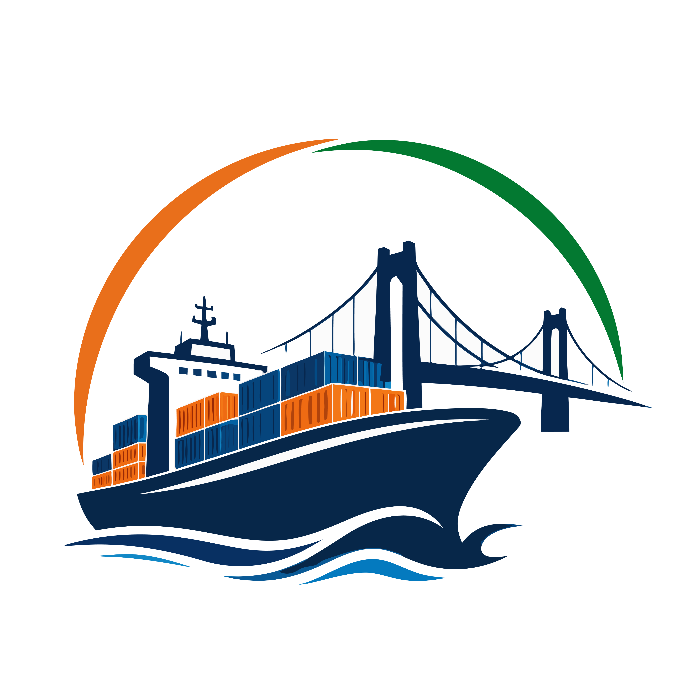

<!-- PROJECT SHIELDS -->
<div align="center">

  [](#)
  [](#)
  [](#)
  [](#)
  [](#)
</div>

<!-- PROJECT LOGO -->
<br />
<div align="center">
  

  <h3 align="center">KargoSetu - Intelligent Freight Forecasting & Bulk Cargo Procurement</h3>

  <p align="center">
    Winning Solution for Smart India Hackathon (SIH) 2026
    <br />
    <a href="Docs/10_Comprehensive_Architecture_And_Security_Plan.md"><strong>Explore the Docs »</strong></a>
    <br />
    <br />
    <a href="#">View Live Demo</a>
    ·
    <a href="#">Watch Pitch Video</a>
    ·
    <a href="#">Report Bug</a>
  </p>
</div>

---

## 🏆 SIH 2026 Problem Statement 

| Category | Details |
| :--- | :--- |
| **Problem Statement ID** | `SIH26006` |
| **Problem Title** | Intelligent Freight Forecasting & Bulk Cargo Procurement Platform for East Coast of India |
| **Organization** | Ministry of Steel (SAIL) |
| **Theme** | Smart Automation & Logistics |

**Objective:** 
To solve the inefficiency of single spot contract dependency by enabling predictive Short/Medium-Term Contracts of Affreightment (CoA) and dual-ended port constraint optimization, maximizing ROI and minimizing idle losses.

---

## ✨ Key Features & Business Value

1. **Optimal Market Entry Timing & Quantile Forecasting:**
   - Multi-horizon Quantile Regression (TensorFlow.js P10/P50/P90) predicting 30-, 60-, and 90-day freight rate curves.
   - Automatically detects 12.5% rate dip windows to trigger CoA contract bookings.
2. **Spot vs. Short/Medium-Term CoA ROI Engine:**
   - Evaluates spot contracts against 3-6 month short-term charters and 1-2 year Contracts of Affreightment.
   - Calculates real-time monetary savings in **₹ Crores** for SAIL (est. ₹35.28 Crores / year).
3. **Dual-Ended Port Infrastructure & Vessel Type Optimization:**
   - Checks Draft, LOA, Beam, and Daily Handling Rates at origin and destination.
   - Auto-recommends Capesize, Panamax, Supramax, Handysize, or offshore lighterage & cargo splitting.
4. **Idle Scenario Management & Positioning:**
   - Minimizes vessel idle loss ($25,000/day for Capesize) by computing triangular repositioning routes.
5. **IMO Scope 3 Carbon Accounting:**
   - Calculates VLSFO fuel consumption and IMO CO2 emission footprints for ESG compliance.

---

## 💻 Tech Stack

| Category | Technologies |
| :--- | :--- |
| **Frontend** | Next.js 15 (App Router), React 19, Tailwind CSS v4, Shadcn UI |
| **State Management** | Zustand, TanStack Query |
| **Backend** | Node.js, Express.js (REST API) |
| **Machine Learning** | TensorFlow.js (LSTM Neural Networks), Yahoo Finance Data (`yahoo-finance2`) |
| **Database & ORM** | PostgreSQL, Prisma ORM |
| **Maps & Charts** | ECharts, MapLibre GL JS |

---

## 📂 Repository Structure

```text
KargoSetu/
├── backend/                  # Express.js REST API & ML Engine
│   ├── index.js              # Server entry point
│   ├── prisma/               # Database schemas & seeding scripts
│   └── services/             
│       ├── maritimeMath.js   # Physics engine (Squat, Sinkage, UKC)
│       └── mlPredictor.js    # TensorFlow.js prediction models
├── frontend/                 # Next.js 15 Web Application
│   ├── src/app/              # App Router pages (Dashboard, Auth, etc.)
│   └── src/components/       # Reusable Shadcn UI & Data viz components
├── Docs/                     # Comprehensive Project Documentation
│   ├── 08_System_Architecture_Diagrams.md
│   └── 10_Comprehensive_Architecture_And_Security_Plan.md
├── .github/                  # CI/CD Workflows & Issue Templates
└── DEVELOPER_GUIDE.md        # Start here if you are a developer!
```

---

## 🚀 Quick Start (Local Development)

Follow these instructions to run the project locally.

### Prerequisites
* **Node.js:** v20 or higher
* **PostgreSQL:** Running locally or via Docker

### 1. Clone the repository
```bash
git clone https://github.com/IamNishant51/KargoSetu.git
cd KargoSetu
```

### 2. Setup the Backend (Express + TensorFlow.js)
```bash
cd backend
npm install

# Setup Prisma Database (Requires PostgreSQL)
# Make sure to create a .env file with DATABASE_URL
npx prisma generate
node prisma/seed.js

# Start the server
npm run dev
```
*The backend will run on `http://localhost:3001`*

### 3. Setup the Frontend (Next.js)
```bash
# Open a new terminal and navigate to the frontend folder
cd frontend
npm install

# Start the development server
npm run dev
```
*The frontend will run on `http://localhost:3000`*

---

## 🛡️ Security & Enterprise Readiness
* **Double Validation:** Strict `Zod` schemas enforced on both Client and Server.
* **ML Sandboxing:** `tf.tidy()` prevents memory leaks during high-load LSTM predictions.
* **Rate Limiting & Helmet:** Backend protected against DoS and XSS attacks.
* For more details, see our [Architecture & Security Plan](Docs/10_Comprehensive_Architecture_And_Security_Plan.md).

---

## 👥 Meet the Team
* **[Nishant]** - Full Stack Architect & ML Lead
* *(Add other team members here)*

<br/>
<p align="center">Made with ❤️ for Smart India Hackathon 2026</p>
