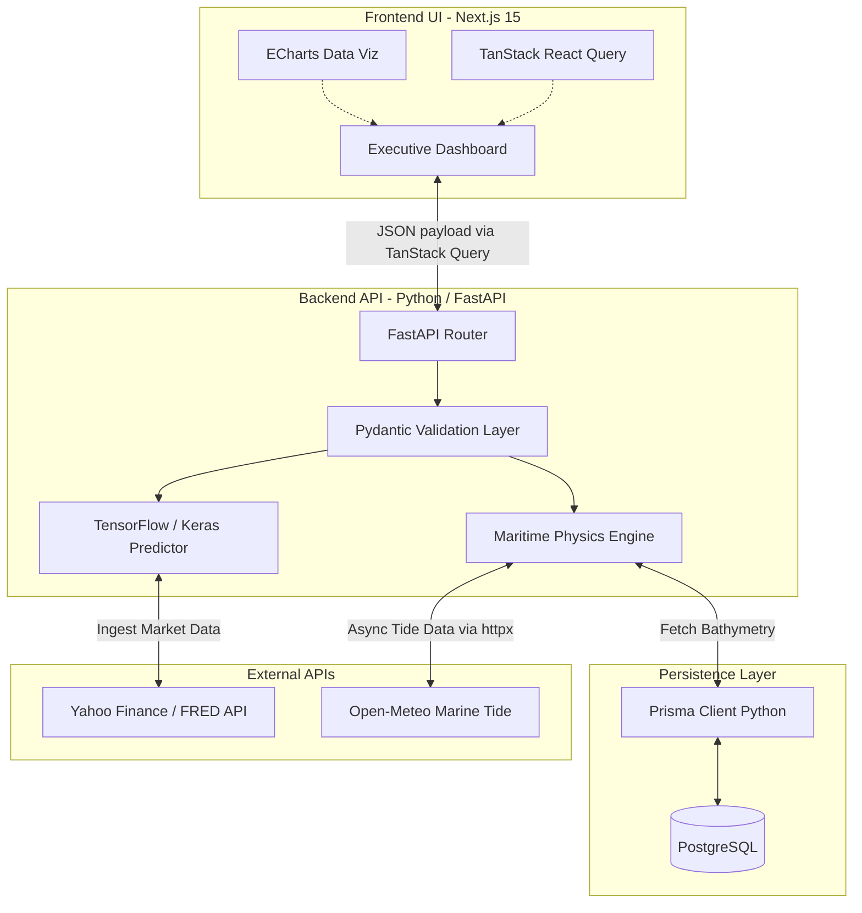

<!-- PROJECT SHIELDS -->
<div align="center">
  <a href="#"></a>
  <a href="#"></a>
  <a href="#"></a>
  <a href="#"></a>
  <a href="#"></a>
</div>

<!-- PROJECT LOGO & HEADER -->
<br />
<div align="center">
  

  <h2 align="center">Intelligent Freight Forecasting & Bulk Cargo Procurement</h2>

  <p align="center">
    <strong>Official Submission for Smart India Hackathon (SIH) 2026</strong>
    <br />
    <br />
    <a href="MIGRATION_PLAN.md"><strong>Explore the Backend Migration Plan »</strong></a>
    <br />
    <br />
    <a href="#">View Live Demo</a>
    ·
    <a href="#">Watch Pitch Video</a>
    ·
    <a href="DEVELOPER_GUIDE.md">Read Developer Guide</a>
  </p>
</div>

<hr />

## SYSTEM OVERVIEW: SIH 26006

<details>
  <summary><strong>Click to expand Problem Statement Details</strong></summary>

| Category | Details |
| :--- | :--- |
| **Problem Statement ID** | `SIH26006` |
| **Problem Title** | Intelligent Freight Forecasting & Bulk Cargo Procurement Platform for East Coast of India |
| **Target Organization** | Ministry of Steel (SAIL) |
| **Hackathon Theme** | Smart Automation & Logistics |

> **Core Objective:** Eradicate the financial inefficiency of single spot contract dependency. KargoSetu enables highly predictive Short/Medium-Term Contracts of Affreightment (CoA) paired with dual-ended port constraint optimization, maximizing fleet ROI and minimizing idle losses for the Ministry of Steel.
</details>

<hr />

## SYSTEM ARCHITECTURE & DATA FLOW

The following diagram illustrates the real-time data pipelines and constraint resolution engines powering the KargoSetu platform.



<hr />

## CORE CAPABILITIES & BUSINESS IMPACT

### 1. Optimal Market Entry Timing & Quantile Forecasting
*   **Mechanism:** Multi-horizon Quantile Regression via Python TensorFlow/Keras, processing multi-variate datasets with vectorized Pandas operations, predicting 30, 60, and 90-day freight rate curves.
*   **Impact:** Automatically detects 12.5% rate dip windows, alerting executives to trigger optimal CoA contract bookings.

### 2. Dual-Ended Port Infrastructure & Vessel Type Optimization
*   **Mechanism:** Analyzes Draft, LOA, Beam, and Daily Handling Rates at both origin (e.g., Newcastle) and destination (e.g., Haldia). Handled via asynchronous DB transactions.
*   **Impact:** Auto-recommends Capesize, Panamax, Supramax, or calculates optimal offshore lighterage and cargo splitting thresholds.

<hr />

## TECHNOLOGY STACK

**Frontend Environment**<br/>


**Backend & Physics Engine**<br/>


**Machine Learning & Intelligence**<br/>


<hr />

## LOCAL DEVELOPMENT SETUP

Follow these instructions to run the enterprise platform locally.

<details open>
  <summary><strong>1. Initialize the Python Backend Services</strong></summary>
  <br/>
  
  The backend is built with FastAPI and runs on Python 3.11+.

  ```bash
  # Navigate to the backend directory
  cd backend

  # Install required Python dependencies
  pip install -r requirements.txt

  # Setup Prisma Database Connection
  # Ensure a .env file is present with the DATABASE_URL string
  prisma generate

  # Boot the ASGI Uvicorn Server
  uvicorn app.main:app --host 0.0.0.0 --port 7860 --reload
  ```
  *The backend API will be live at `http://localhost:7860`*
</details>

<details>
  <summary><strong>2. Initialize the Next.js Frontend Application</strong></summary>
  <br/>

  ```bash
  # Open a secondary terminal instance
  cd frontend

  # Install Node dependencies
  npm install

  # Boot the Next.js development server
  npm run dev
  ```
  *Access the Executive Command Center at `http://localhost:3000`*
</details>

<hr />

## ENTERPRISE SECURITY PROTOCOLS
This system is engineered to enterprise logistics standards:
* **Payload Validation:** Strict `Pydantic` schemas enforced on the Server parameters.
* **ML Sandboxing:** Dedicated asynchronous `asyncio.to_thread()` implementations prevent I/O blocking during high-load LSTM prediction sequences.
* **Database Pooling:** `prisma.connect()` and `disconnect()` managed via FastAPI Lifespan Hooks to prevent zombie connections.

<hr />

## PROJECT CONTRIBUTORS
* **Nishant** - Full Stack Architect & ML Lead
* *(Additional team members to be added)*

<br/>
<div align="center">
  <p>Engineered for the Smart India Hackathon 2026</p>
</div>
