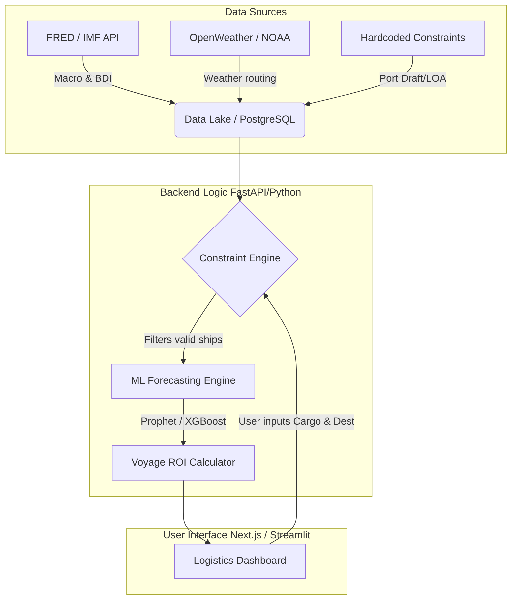
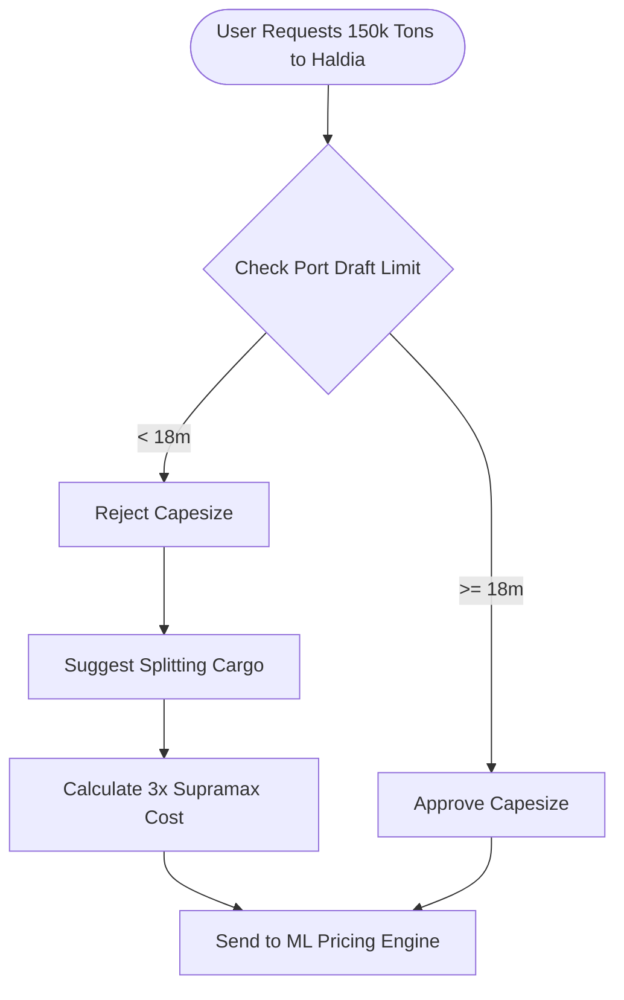

# Project KargoSetu (SIH26006)
**Intelligent Freight Forecasting & Vessel Chartering Model**

> **The Mission:** Transition SAIL from reactive, daily spot-market chartering to proactive, predictive short/medium-term bulk cargo contracts using AI and hardcoded infrastructure constraints.

---

## 1. System Architecture (How it all connects)
*To win, you must show the judges you understand how data flows from the real world into actionable business logic.*



---

## 2. The Core Data Models (Code-Ready)
*Don't just look at the data; model it. Here is how you should structure your database (PostgreSQL/SQLAlchemy) to make the logic work instantly.*

### A. The Port Constraint Matrix
This is your secret weapon. If you don't enforce these limits, your model is useless to SAIL.

```json
// Example: The East Coast Constraint Database
{
  "ports": [
    {
      "name": "Haldia",
      "type": "Riverine",
      "max_draft_m": 8.5,
      "max_loa_m": 230,
      "capesize_allowed": false,
      "warning": "Requires smaller vessels or lightening at sea."
    },
    {
      "name": "Paradip",
      "type": "Deep Water",
      "max_draft_m": 16.0,
      "max_loa_m": 300,
      "capesize_allowed": true,
      "warning": "Tidal dependencies apply."
    }
  ]
}
```

### B. Vessel Classification (The Supply)
```python
# Python Dictionary mapping for your routing algorithm
VESSEL_CLASSES = {
    "Handysize": {"dwt_range": (15000, 35000), "draft_m": 10.0},
    "Supramax":  {"dwt_range": (50000, 60000), "draft_m": 11.5},
    "Panamax":   {"dwt_range": (65000, 80000), "draft_m": 14.0},
    "Capesize":  {"dwt_range": (150000, 180000), "draft_m": 18.0}
}
```

---

## 3. The Logic: Constraint Satisfaction Engine
*Before forecasting price, you must forecast physics. This flowchart shows the logic your backend must execute when a user requests a shipment.*



---

## 4. Curated Data Sources (The Hackathon Arsenal)

You don't need expensive enterprise APIs to win. Use these free/proxy sources to build a massive, high-fidelity dataset.

### Freight Rates & Macro (The Target Variable)
*   **[FRED (St. Louis Fed) - BDIY](https://fred.stlouisfed.org/series/BDIY):** The ultimate free source for the Baltic Dry Index (BDI). Use this as your primary target variable for the ML model.
*   **[World Bank Pink Sheet](https://www.worldbank.org/en/research/commodity-markets):** Free monthly data for global Coking Coal and Iron Ore prices.
*   **[Investing.com BDI](https://www.investing.com/indices/baltic-dry):** Good for scraping daily historical trends.

### Ports & Constraints (The Rules)
*   **[SEA-DISTANCES.org](https://www.sea-distances.com/):** Use this to manually build a static Distance Matrix (e.g., Newcastle to Paradip = 5,800 Nautical Miles).
*   **[Equasis](https://www.equasis.org/):** Free registry to check real-world ship dimensions if you want to populate your database with real ship names.

---

## 5. Machine Learning Strategy

Don't overcomplicate the AI. A reliable Time-Series model beats a broken Deep Learning model.

**1. The Setup:**
```python
# The perfect feature matrix for your model
features = [
    "BDI_trailing_30_days",
    "coking_coal_price_current",
    "bunker_fuel_price_current",
    "distance_nautical_miles",
    "month_of_year" # captures monsoon seasonality
]
target = "forecasted_freight_rate_usd"
```

**2. The Models to Use:**
*   **Baseline:** `Prophet` (by Meta). Excellent for handling seasonality (like Indian monsoons slowing down port operations).
*   **Advanced:** `XGBoost`. Great for capturing non-linear relationships (e.g., fuel prices spiking suddenly).

---

## 6. Execution Plan (Hackathon Timeline)

*   [ ] **Day 1: The Foundation.** Hardcode the Indian East Coast port constraints (Paradip, Haldia, Vizag) into a database. Build the distance matrix to Australia, Indonesia, and USA.
*   [ ] **Day 2: Data Engineering.** Pull the BDI history from FRED and Coal prices from the World Bank. Write a Python script to merge them into one clean CSV (`date`, `bdi`, `coal_price`).
*   [ ] **Day 3: The Brains.** Write the `Constraint Engine` in Python (the logic that prevents a Capesize from going to Haldia). Train a basic `XGBoost` model on the CSV data.
*   [ ] **Day 4: The Interface.** Build a Streamlit or Next.js dashboard. It MUST have a clear "Spot vs. Medium-Term Contract Savings" widget.
*   [ ] **Day 5: The Pitch.** Polish the UI. Prepare a demo showing a ship being dynamically rerouted due to draft constraints, proving you solved SAIL's specific problem.


---

### Potential Judge Questions

Based on the provided documentation for Project KargoSetu, here are 10 thoughtful and probing questions to evaluate the team's technical depth, logic, and alignment with the problem statement:

1. **Mission & Value Proposition:** Your mission is to transition SAIL from reactive spot-market chartering to proactive short/medium-term contracts. How exactly does your "Voyage ROI Calculator" quantify the financial risk or cost savings between these two approaches to prove the value of your predictions?
2. **ML Model Selection:** You have chosen Prophet and XGBoost for the ML Forecasting Engine to process Macro and BDI data. Given how volatile the shipping market can be, how do these specific algorithms handle sudden, unpredictable macroeconomic shocks compared to traditional time-series models?
3. **Dynamic Constraints:** The Port Constraint Matrix notes that Paradip has "Tidal dependencies apply." Since your current JSON structure uses a static `max_draft_m` of 16.0, how does your Constraint Engine plan to programmatically handle dynamic, time-based constraints like tides?
4. **Logic Engine Edge Cases:** The Port Constraint Matrix mentions that Haldia requires "smaller vessels or lightening at sea." However, your flowchart only shows splitting the cargo into smaller ships (e.g., 3x Supramax) when a Capesize is rejected. Does your engine computationally support the logistics and costs of "lightening at sea" as an alternative?
5. **Data Pipeline Resilience:** Your Data Lake relies on external APIs like FRED, IMF, OpenWeather, and NOAA. In the context of your FastAPI backend, how does the system handle API rate limits, downtime, or data staleness to ensure the ML Forecasting Engine doesn't output skewed predictions?
6. **Compounding Costs in ROI:** When the Constraint Engine suggests splitting a 150k ton cargo into 3x Supramax vessels to meet Haldia's 8.5m draft limit, does the ML Pricing Engine and Voyage ROI Calculator dynamically account for the compounded port fees, delays, and queuing times of managing three separate ships?
7. **Weather Routing Integration:** You are piping OpenWeather/NOAA data into your PostgreSQL Data Lake. Exactly how does this data interact with the ML Forecasting Engine or ROI Calculator? Is it used strictly to adjust voyage duration, or does it influence the predicted freight rate?
8. **Vessel Draft Calculations:** Your `VESSEL_CLASSES` dictionary assigns a static `draft_m` to each vessel class (e.g., Panamax at 14.0m). In reality, a vessel's draft changes based on how much deadweight tonnage (DWT) is loaded. Does your engine calculate the *actual* draft based on the user's specific cargo input, or does it safely assume the vessel's maximum draft?
9. **Forecasting Granularity:** If the Constraint Engine dictates that a shipment must be split into multiple smaller vessels, does the ML Forecasting Engine predict an aggregated bulk freight rate, or does it individually forecast the spot/contract rates for that specific vessel class (e.g., predicting the specific Supramax market rate vs the Capesize market rate)?
10. **Defining ROI for SAIL:** The final step in your backend logic is a "Voyage ROI Calculator." Since SAIL is fundamentally chartering vessels to transport goods rather than operating as a commercial shipping line seeking profit from freight, how are you mathematically defining "Return on Investment" (ROI) in this specific cost-center context?
