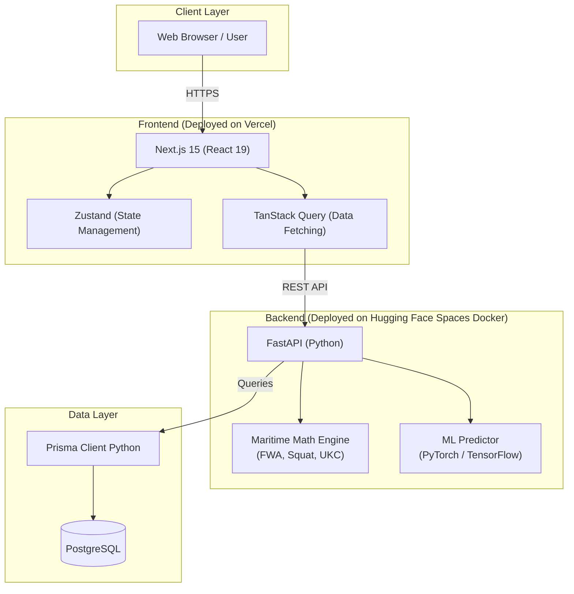
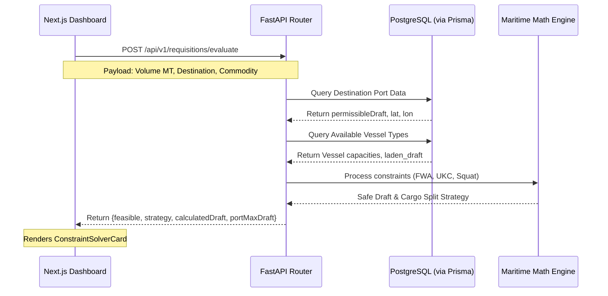
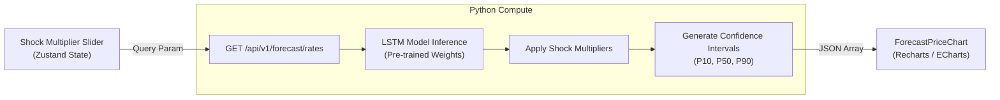

# KargoSetu System Architecture

This document contains the system architecture diagrams for the KargoSetu platform (SIH26006). These diagrams are written in Mermaid.js syntax and can be directly rendered in GitHub, Notion, or exported as images for PowerPoint presentations.

## 1. High-Level Infrastructure & Deployment

This diagram illustrates the split architecture, separating the interactive UI layer from the heavy compute required by the Maritime Math Engine and ML models.

## 2. Constraint Solver & Cargo Splitting Flow

This sequence diagram details the interaction between the frontend, backend, and database when calculating whether a vessel can safely berth given tidal constraints and required cargo splitting.

## 3. Predictive ML Freight Engine

This flowchart explains how market shock multipliers (like geopolitical events or fuel hikes) are fed into the system to generate P10/P50/P90 probability forecasts.

