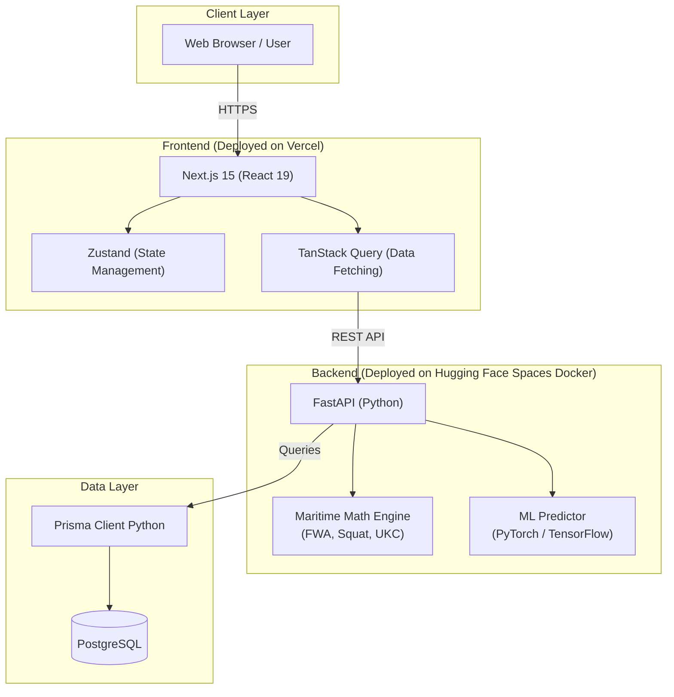
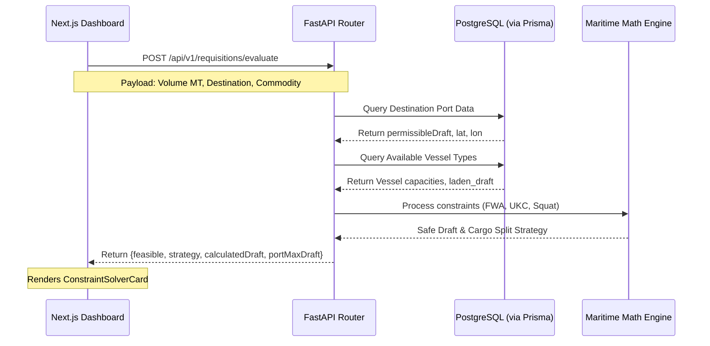
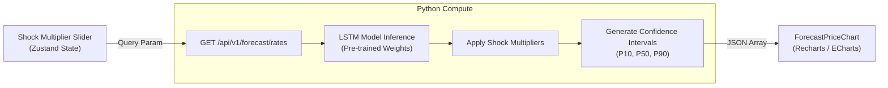

# KargoSetu System Architecture

This document contains the system architecture diagrams for the KargoSetu platform (SIH26006). These diagrams are written in Mermaid.js syntax and can be directly rendered in GitHub, Notion, or exported as images for PowerPoint presentations.

## 1. High-Level Infrastructure & Deployment

This diagram illustrates the split architecture, separating the interactive UI layer from the heavy compute required by the Maritime Math Engine and ML models.

## 2. Constraint Solver & Cargo Splitting Flow

This sequence diagram details the interaction between the frontend, backend, and database when calculating whether a vessel can safely berth given tidal constraints and required cargo splitting.

## 3. Predictive ML Freight Engine

This flowchart explains how market shock multipliers (like geopolitical events or fuel hikes) are fed into the system to generate P10/P50/P90 probability forecasts.

---

### Potential Judge Questions

Based on the provided system architecture documentation, here are 10 thoughtful and probing questions to evaluate the team's technical decisions, system design, and algorithms:

1. **Deployment Architecture**: You have chosen to deploy your FastAPI backend on Hugging Face Spaces Docker while hosting the Next.js frontend on Vercel. Hugging Face Spaces are traditionally designed for ML demos and can suffer from "cold starts" or memory limits. How are you ensuring production-level latency, uptime, and secure database connection pooling to PostgreSQL from this environment?
2. **Database ORM Selection**: I see you are using Prisma Client Python to connect FastAPI to PostgreSQL. Since Prisma is heavily optimized for Node.js/TypeScript environments, what drove the decision to use the Python port over native, highly optimized Python asynchronous ORMs like SQLAlchemy or SQLModel?
3. **Dynamic vs. Static Constraints**: In your Constraint Solver sequence diagram, the FastAPI router queries the database for static port data (`permissibleDraft`, `lat`, `lon`). However, the Maritime Math Engine calculates FWA (Fresh Water Allowance), UKC (Under Keel Clearance), and Squat—all of which rely on dynamic variables like real-time water density, real-time tides, and vessel speed. How and where is the engine sourcing this dynamic data?
4. **Cargo Splitting Optimization**: The sequence diagram shows the engine returning a "Cargo Split Strategy" based on available vessel capacities and drafts. Under the hood, what specific algorithm are you using to determine this split? Is it a simple greedy heuristic, or are you employing a mathematical optimization algorithm (like the Knapsack problem) to minimize cost and fleet usage?
5. **Handling Infeasible Requisitions**: The API payload returns a `{feasible, strategy, ...}` object. If a requisition is deemed completely infeasible due to extreme draft constraints or a lack of suitable vessels, how does the system handle this? Does it calculate and suggest a nearest alternative port, or simply reject the requisition?
6. **ML Inference Pipeline**: The Predictive ML Freight Engine flowchart shows that "Shock Multipliers" are applied *after* the LSTM Model Inference. Geopolitical events and fuel hikes often have complex, non-linear impacts on freight rates. Why did you choose to apply these multipliers as a post-processing step rather than engineering them as features to be fed directly into the LSTM model during inference?
7. **Confidence Interval Generation**: Your ML pipeline generates P10, P50, and P90 confidence intervals for freight forecasts. Since standard LSTMs generally output deterministic point predictions, what methodology are you using to generate these quantiles? Are you using Quantile Regression, Monte Carlo Dropout, or simply applying a statistical variance formula post-inference? 
8. **Heavy Compute Management**: Both the Maritime Math Engine and the ML Predictor reside within the same FastAPI backend instance. Because Python is single-threaded (due to the GIL), how are you preventing long-running ML inferences or complex constraint calculations from blocking concurrent API requests from other users? Are you using any background task queues (like Celery)?
9. **State Management vs. Data Fetching**: In the high-level architecture, you list both Zustand for state management and TanStack Query for data fetching. In the ML Engine diagram, the Shock Multiplier Slider uses Zustand state to trigger a query parameter change. How are you debouncing or caching these rapid slider changes to prevent spamming the FastAPI backend with heavy LSTM inference requests?
10. **Security & Data Transfer**: The Next.js client fetches data from the Hugging Face backend via a REST API over HTTPS. Given that the ML predictor and cargo splitting engine might return large JSON arrays of time-series data or complex strategy objects, have you implemented any specific data serialization optimizations or pagination strategies to keep the Vercel-to-Hugging Face payload lightweight?
